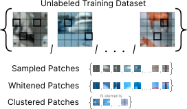
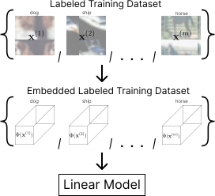

# Efficient Learning of CNNs using Patch Based Features

## Table of Contents

- [Efficient Learning of CNNs using Patch Based Features](#efficient-learning-of-cnns-using-patch-based-features)
  - [Table of Contents](#table-of-contents)
  - [Summary of our Empirical Study](#summary-of-our-empirical-study)
    - [Report link](#report-link)
    - [The patch-based image embedding](#the-patch-based-image-embedding)
    - [The semi-supervised algorithm](#the-semi-supervised-algorithm)
  - [Getting started](#getting-started)
    - [Creating the environment](#creating-the-environment)
    - [Set up wandb](#set-up-wandb)
    - [How to run experiments](#how-to-run-experiments)
  - [Reproducing the experiments from the paper](#reproducing-the-experiments-from-the-paper)
    - [Table 1: Comparison between our algorithm and baselines](#table-1-comparison-between-our-algorithm-and-baselines)
    - [Table 2: The effect of the constraint on the linear function](#table-2-the-effect-of-the-constraint-on-the-linear-function)
    - [Table 3: Examining the effect of pooling and bottleneck](#table-3-examining-the-effect-of-pooling-and-bottleneck)
    - [Table 4: Test accuracy across depth](#table-4-test-accuracy-across-depth)
    - [Figure 5: Mean distance between patches and centroids](#figure-5-mean-distance-between-patches-and-centroids)
    - [Appendix C.4: Whitening](#appendix-c4-whitening)
    - [Appendix C.5: The effects of the different parameters in our model](#appendix-c5-the-effects-of-the-different-parameters-in-our-model)

## Summary of our Empirical Study

### Report link

Check out the [wandb report](https://wandb.ai/alonnt/patch-based-learning/reports/Efficient-Learning-of-CNNs-using-Patch-Based-Features--VmlldzoyMTgxMjYw) summarizing the results of our empirical study.\
Clicking on a run will open its page in wandb, which might be useful: 1) view the exact command line and packages requirements enabling re-producing the run. 2) enables downloading the checkpoint to play around with the model by yourself. 3) more visualizations (accuracy, losses, images, etc).

### The patch-based image embedding

An illustration of the patch-based image embedding. For more information please refer to the paper.

<p align="center">

</p>

### The semi-supervised algorithm

An illustration of the semi-supervised algorithm, containing an unsupervised stage to obtain the *patches dictionary* which is then used by the embedding in the supervised stage. For more information please refer to the paper.

<p align="center">
 &nbsp; &nbsp; &nbsp; &nbsp; &nbsp; &nbsp; &nbsp; &nbsp;

</p>

## Getting started

### Creating the environment

Create the conda environment named *patch-based-learning* and activate it:
```shell
conda env create --file environment.yml
conda activate patch-based-learning
```
Notes:
- It's recommended to install [faiss](https://github.com/facebookresearch/faiss) as well, 
  to enable running k-means faster (can take a couple of minutes with faiss, instead of almost 1 hour with sklearn).  
  Run 
  ```shell
  conda install -c pytorch faiss-cpu=1.7.2
  ```
  and the code will recognize the environment has faiss and use it instead of sklearn.
  - It's not by default in the environment.yml file because faiss is not always available in conda 
  (for example for mac os with m1 chip, as of June 2022).
- If the creation of the environment takes too long, consider using [mamba](https://github.com/mamba-org/mamba) 
instead of conda.

### Set up wandb

We use [wandb](wandb.ai) for visualizing the experiments.
For setting everything up, this section needs to be performed (once, like building the environment).\
[Login](https://app.wandb.ai/login) online to wandb. Then, in the environment containing wandb, run `wandb login`.

### How to run experiments

You can run the commands on GPU by passing `--device cuda:0` (or any other device number).
You can also use multiple GPUs by passing `--multi_gpu X` where `X` can be `-1` which will take all available GPUs,
or a list of GPUs like `--multi_gpu 0 1 4 5 6 8`.

In order to log each run to wandb to the corresponding project, you'll need to add `--wandb_project_name WANDB-PROJECT-NAME` (or edit the default value in `schemas/environment.py`). In order to give a name to a run, you can use the argument `--wandb_run_name RUN-NAME` (although the names can be changed later using the wandb website).

## Reproducing the experiments from the paper

Below you can find command-lines to reproduce each experiment from the paper.\
Notes:

- The accuracy reported in the table is the maximal accuracy achieved during the training phase (measured after each epoch).
- The numbers you'll get can be slightly different to those reported in the paper, because the experiments in the paper were launched 5 times and the we report the mean (+-std) of the (maximal) accuracy.

### Table 1: Comparison between our algorithm and baselines

- **Vanilla 1 hidden-layer CNN**

  ```shell
  python main.py --train_locally_linear_network True --replace_embedding_with_regular_conv_relu True --use_conv False --wandb_run_name "Table 1 - Vanilla 1 hidden-layer CNN"
  ```

- **Phi_hard with random patches**

  ```shell
  python main.py --train_locally_linear_network True --use_conv False --random_gaussian_patches True --wandb_run_name "Table 1 - Phi_hard with random patches"
  ```

- **Phi_full with random patches**

  ```shell
  python main.py --train_locally_linear_network True --use_conv True --random_gaussian_patches True --wandb_run_name "Table 1 - Phi_full with random patches"
  ```

- **Phi_hard with clustered patches**

  ```shell
  python main.py --train_locally_linear_network True --use_conv False --random_gaussian_patches False --wandb_run_name "Table 1 - Phi_hard with clustered patches"
  ```

- **Phi_full with clustered patches**

  ```shell
  python main.py --train_locally_linear_network True --use_conv True --random_gaussian_patches False --wandb_run_name "Table 1 - Phi_full with clustered patches"
  ```

### Table 2: The effect of the constraint on the linear function

- **Simple**

  ```shell
  python main.py --train_locally_linear_network True --use_conv False --use_avg_pool False --use_batch_norm False --use_bottle_neck False --k 64 --full_embedding True --batch_size 32 --n_clusters 256 --n_patches 65536 --learning_rate 0.00001 --wandb_run_name "Table 2 - Simple"
  ```

- **Constrained**

  ```shell
  python main.py --train_locally_linear_network True --use_conv True  --use_avg_pool False --use_batch_norm False --use_bottle_neck False --k 64 --full_embedding False --batch_size 32 --n_clusters 256 --n_patches 65536 --learning_rate 0.001 --wandb_run_name "Table 2 - Constrained"
  ```

### Table 3: Examining the effect of pooling and bottleneck

- **Original**

  ```shell
  python main.py --train_locally_linear_network True --use_avg_pool False --use_batch_norm False --use_bottle_neck False --wandb_run_name "Table 3 - Original"
  ```

- **AvgPool**

  ```shell
  python main.py --train_locally_linear_network True --use_avg_pool True --use_batch_norm True --use_bottle_neck False --wandb_run_name "Table 3 - AvgPool"
  ```

- **Bottleneck**

  ```shell
  python main.py --train_locally_linear_network True --use_avg_pool False --use_batch_norm False --use_bottle_neck True --wandb_run_name "Table 3 - Bottleneck"
  ```

- **Both**

  ```shell
  python main.py --train_locally_linear_network True --use_avg_pool True --use_batch_norm True --use_bottle_neck True --wandb_run_name "Table 3 - Both"
  ```

### Table 4: Test accuracy across depth

- **Phi_full depths 1, 2, 3, 4**

  ```shell
  python main.py --train_locally_linear_network True --depth 4 --kernel_size 5 3 3 3 --use_avg_pool True False False False --pool_size 2 --pool_stride 2 --use_batch_norm True False False False --k 256 128 128 128 --wandb_run_name "Table 4 - Phi_full"
  ```

- **Phi_hard depths 1, 2, 3, 4**

  ```shell
  python main.py --train_locally_linear_network True --depth 4 --kernel_size 5 3 3 3 --use_conv False --use_avg_pool True False False False --pool_size 2 --pool_stride 2 --use_batch_norm True False False False --k 256 128 128 128 --wandb_run_name "Table 4 - Phi_hard"
  ```

- **CNN**
  - **Depth 1**

    ```shell
    python main.py --model_name VGGc1024d1A --kernel_size 5 --padding 0 --use_batch_norm True --final_mlp_n_hidden_layers 0 --use_relu_after_bottleneck True --wandb_run_name "Table 4 - CNN Depth 1"
    ```

  - **Depth 2**

    ```shell
    python main.py --model_name VGGc1024d2A --kernel_size 5 3 --padding 0 --use_batch_norm True False --final_mlp_n_hidden_layers 0 --use_relu_after_bottleneck True --wandb_run_name "Table 4 - CNN Depth 2"
    ```

  - **Depth 3**

    ```shell
    python main.py --model_name VGGc1024d3A --kernel_size 5 3 3 --padding 0 --use_batch_norm True False False --final_mlp_n_hidden_layers 0 --use_relu_after_bottleneck True --wandb_run_name "Table 4 - CNN Depth 3"
    ```

  - **Depth 4**

    ```shell
    python main.py --model_name VGGc1024d4A --kernel_size 5 3 3 3 --padding 0 --use_batch_norm True False False False --final_mlp_n_hidden_layers 0 --use_relu_after_bottleneck True --wandb_run_name "Table 4 - CNN Depth 4"
    ```

- **CNN (layerwise) depths 1, 2, 3, 4**

  ```shell
  python main.py --train_locally_linear_network True --train_locally_linear_network True --depth 4 --kernel_size 5 3 3 3 --replace_embedding_with_regular_conv_relu True --use_conv False --use_avg_pool True False False False --pool_size 2 --pool_stride 2 --use_batch_norm True False False False --wandb_run_name "Table 4 - CNN layerwise"
  ```

### Figure 5: Mean distance between patches and centroids

- CIFAR-10:

  ```shell
  python intrinsic_dimension_playground.py --dataset_name CIFAR10 --wandb_run_name "CIFAR10 patches intrinsic-dimension"
  ```

- ImageNet (the validation dataset needs to be downloaded beforehand):

  ```shell
  python intrinsic_dimension_playground.py --dataset_name ImageNet --wandb_run_name "ImageNet patches intrinsic-dimension"
  ```

### Appendix C.4: Whitening

The patches in use by our algorithm (the *patches dictionary*) are logged to wandb each run. Generally, in the figures we take the patches from the very end of the training phase (you can also view the patches at the beginning of the training).

- Figure 6: CNN kernels (left), our whitened patches (right)
  - CNN kernels (*Vanilla 1 hidden-layer CNN* from Table 1):\
    The patches are taken from the wandb plot *best_patches*.

    ```shell
    python main.py --train_locally_linear_network True --replace_embedding_with_regular_conv_relu True --use_conv False --wandb_run_name "Vanilla 1 hidden-layer CNN"
    ```

  - Our whitened patches (similar to *Phi_full with clustered patches* from Table 1, but with ZCA-whitening and not the default PCA-whitening) (the patches are taken from the wandb plot *best_patches_whitened*):

    ```shell
    python main.py --train_locally_linear_network True --use_conv True --random_gaussian_patches False --wandb_run_name "Phi_full with clustered patches using ZCA whitening" -zca_whitening True
    ```

- Figure 7: Patches before and after ZCA-whitening
  Use the same run as in Figure 6 (*Phi_full with clustered patches using ZCA whitening*) and observe *best_patches* and *best_patches_whitened*.

### Appendix C.5: The effects of the different parameters in our model

- Figure 8: Accuracy per k (number of neighbors), where the patches-dictionary size is 1,024

  ```shell
  foreach K ( 1 2 4 8 16 32 64 128 256 512 1024 )
    python main.py --train_locally_linear_network True --wandb_run_name "Phi_full with clustered patches k=${K}" --k ${K}
  ```

- Figure 9: Accuracy per dictionary-size
  - Dictionary size 1,024 (256 neighbors, 262,144 sampled patches for clustering)

  ```shell
  python main.py --train_locally_linear_network True --wandb_run_name "Phi_full with clustered patches M=262144 N=1024 k=256" --n_patches 262144 --n_clusters 1024 --k 256
  ```

  - Dictionary size 2,048 (512 neighbors, 524,288 sampled patches for clustering)

  ```shell
  python main.py --train_locally_linear_network True --wandb_run_name "Phi_full with clustered patches M=524288 N=2048 k=512" --n_patches 524288 --n_clusters 2048 --k 512
  ```

  - Dictionary size 4,096 (1,024 neighbors, 1,048,576 sampled patches for clustering)

  ```shell
  python main.py --train_locally_linear_network True --wandb_run_name "Phi_full with clustered patches M=1048576 N=4096 k=1024" --n_patches 1048576 --n_clusters 4096 --k 1024
  ```

  - Dictionary size 8,192 (2,048 neighbors, 2,097,152 sampled patches for clustering)

  ```shell
  python main.py --train_locally_linear_network True --wandb_run_name "Phi_full with clustered patches M=2097152 N=8192 k=2048" --n_patches 2097152 --n_clusters 8192 --k 2048
  ```

  - Dictionary size 16,384 (4,096 neighbors, 4,194,304 sampled patches for clustering)

  ```shell
  python main.py --train_locally_linear_network True --wandb_run_name "Phi_full with clustered patches M=4194304 N=16384 k=4096 lr=0.001" --n_patches 4194304 --n_clusters 16384 --k 4096 --learning_rate 0.001
  ```
